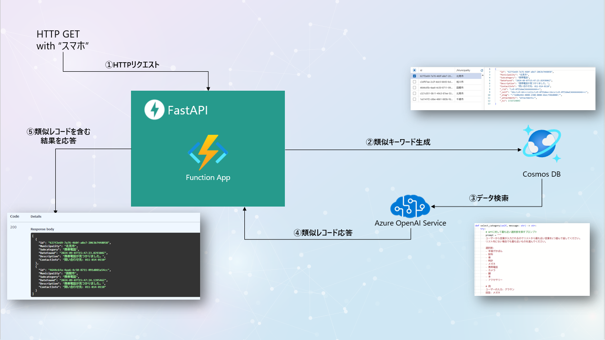
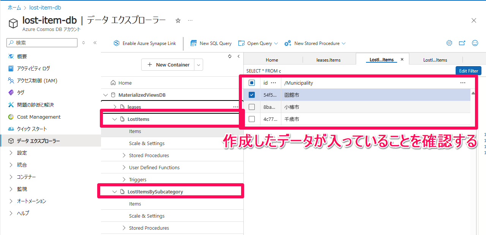
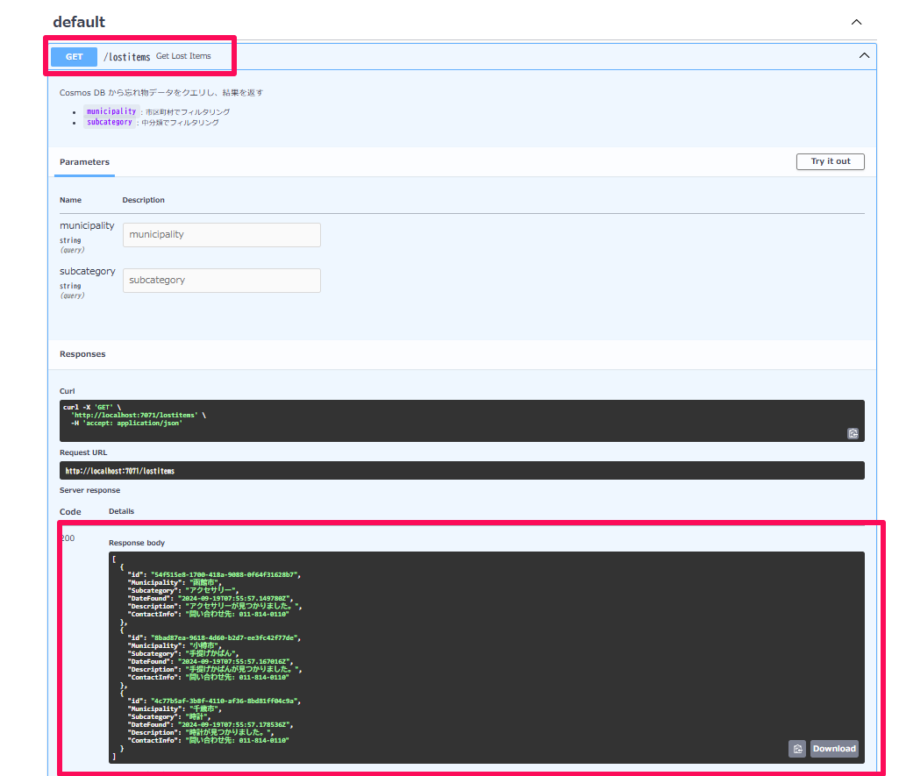
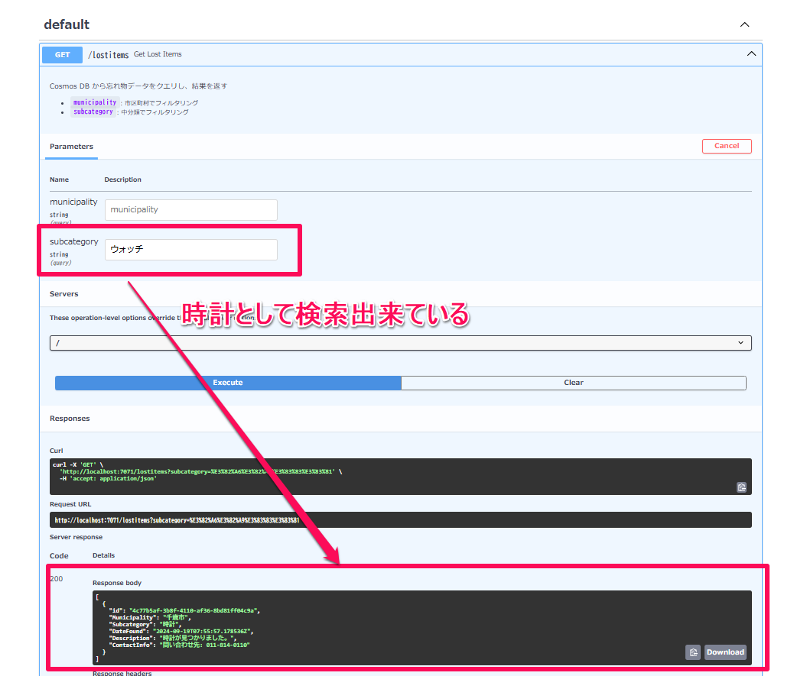
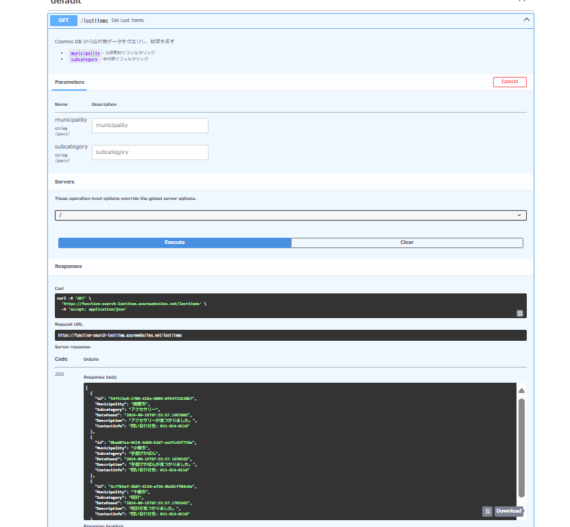

# プロジェクト概要
このプロジェクトは、落とし物を検索するシステムを構築するためのもので、**Cosmos DB** と **Azure OpenAI** を活用しています。データの登録には**Materialized View**（[詳細はこちら](https://github.com/Azure-Samples/cosmos-db-design-patterns/tree/main/materialized-view)）を使用し、検索APIは**Python**で実装、フロントエンドは**Next.js**を使用しています。




# システム構成

### データベース: Cosmos DB
- 落とし物のデータを保存するためにCosmos DBを使用します。
- パフォーマンスとスケーラビリティを考慮して、各データは特定のパーティションキーで管理されます。

### データ登録: Materialized View (.NET)
- データの登録処理はMaterialized Viewパターンを使用して、データを効率的に集約します。
- **Materialized View**の作成と管理には**.NET**を使用しています。これにより、クエリの高速化やデータの事前集約を実現しています。
- 詳細については[Materialized View Design Pattern](https://github.com/Azure-Samples/cosmos-db-design-patterns/tree/main/materialized-view)を参照してください。

### 検索用API: Python
- 検索システムのAPIはPythonで実装されています。Azure OpenAIを使用して、フリーワードから落とし物を検索することができます。

### フロントエンド: Next.js
- フロントエンドは**Next.js**を使用して構築されています。直感的で反応の良いUIを提供し、ユーザーは簡単に検索を行うことができます。

# セットアップ手順

### 前提条件
このプロジェクトをセットアップするためには、以下のものが必要です。
- Node.js (推奨バージョン: 18.x以上)
- Python (推奨バージョン: 3.10以上)
- .NET 8.0 ランタイム
- Functions Core Tools (4.x以上のバージョンが必須)
- Azure サブスクリプション
- Azure CLI

### Azure リソースの作成
1. Azure にログインします。
    ```bash
    az login
    ```
2. 下記のコマンドでリソースグループを作成します。
    ```bash
    az group create --name <リソースグループ名> --location <リージョン>
    ```
3. 下記のコマンドでAzure OpenAI リソースを作成します。
    ```bash
    az cognitiveservices account create --name <OpenAIリソース名> --resource-group <リソースグループ名> --kind OpenAI --sku S0 --location eastus
    ```
4. 下記のコマンドで、GPT-4o-miniのを作成します。
    ```bash
    az cognitiveservices account deployment create --name <OpenAIのリソース名> --resource-group <リソースグループ名> --deployment-name <GPTのデプロイ名> --model-name gpt-4o-mini --model-version "2024-07-18" --model-format OpenAI --sku-capacity "10" --sku-name "GlobalStandard"
    ```
5. 下記のコマンドで、Azure OpenAI のエンドポイントを取得します(プロジェクトのセットアップでデータ検索用関数の設定で使用します)。
    ```bash
    az cognitiveservices account show --name <OpenAIリソース名> --resource-group <リソースグループ名> --query "properties.endpoint" --output tsv
    ```
6. 下記のコマンドで、Azure OpenAI のキーを取得します(プロジェクトのセットアップでデータ検索用関数の設定で使用します)。
    ```bash
    az cognitiveservices account keys list --name <OpenAIリソース名> --resource-group <リソースグループ名> --query "key1" --output tsv
    ```
7. 下記のコマンドでCosmos DB アカウントを作成します。
    ```bash
    az cosmosdb create --name <Cosmos DB アカウント名> --resource-group <リソースグループ名> --kind GlobalDocumentDB --locations regionName=<リージョン> failoverPriority=0 isZoneRedundant=False
    ```
8. 下記のコマンドで、Cosmos DB のUriを取得します(プロジェクトのセットアップでデータジェネレータの設定で使用します)。
    ```bash
    az cosmosdb show --name <CosmosDBアカウント名> --resource-group <リソースグループ名> --query "documentEndpoint" --output tsv
    ```
9. 下記のコマンドで、Cosmos DB のキーを取得します(プロジェクトのセットアップでデータジェネレータの設定で使用します)。
    ```bash
    az cosmosdb keys list --name <CosmosDBアカウント名> --resource-group <リソースグループ名> --query "primaryMasterKey" --output tsv
    ```
10. 下記のコマンドで、Cosmos DB の接続文字列を取得します(プロジェクトのセットアップでデータ複製関数で使用します)。
    ```bash
    az cosmosdb keys list --name <CosmosDBアカウント名> --resource-group <リソースグループ名> --query "connectionStrings[0].connectionString" --type connection-strings --output tsv
    ```


### プロジェクトのセットアップ
1. リポジトリをクローンします。
    ```bash
    git clone https://github.com/marumaru1019/POC-LostItemSearch.git
    ```
2. データジェネレータの設定
  - `source/data-generator` ディレクトリに移動し.次の内容を含む新しい appsettings.development.json ファイルを追加します。CosmosUriには、Cosmos DB アカウントの URI を、CosmosKey には Cosmos DB アカウントのキーを指定します。
    ```json
    {
      "CosmosUri": "取得したCosmos DB のUri",
      "CosmosKey": "取得したCosmos DB のキー"
    }
    ```
3. データ複製関数の設定
  - `source/function-app` ディレクトリに移動し、次の内容を含む新しい local.settings.json ファイルを追加します。CosmosConnectionStringには、Cosmos DB アカウントの接続文字列を指定します。
    ```json
    {
      "IsEncrypted": false,
      "Values": {
        "AzureWebJobsStorage": "UseDevelopmentStorage=false",
        "FUNCTIONS_WORKER_RUNTIME": "dotnet",
        "CosmosDBConnection" : "取得したCosmos DB の接続文字列"
      }
    }
    ```
4. データ検索用関数の設定
`fastapi-on-azure-functions`のディレクトリに移動し、次の内容を含む新しい local.settings.json ファイルを追加します。CosmosEndpointには、Cosmos DB アカウントの URI を、CosmosKey には Cosmos DB アカウントのキーを指定します。AzureOpenAIEndpointには、Azure OpenAI のエンドポイントを、AzureOpenAIKey には Azure OpenAI のキーを指定します。AzureOpenAIDeploymentには、Azure OpenAI のデプロイメント名を指定します。
    ```json
    {
      "IsEncrypted": false,
      "Values": {
        "AzureWebJobsStorage": "",
        "FUNCTIONS_WORKER_RUNTIME": "python",
        "AzureWebJobsFeatureFlags": "EnableWorkerIndexing",
        "COSMOS_ENDPOINT": "取得したCosmos DB のUri",
        "COSMOS_KEY": "取得したCosmos DB のキー",
        "AZURE_OPENAI_ENDPOINT": "取得したAzure OpenAI のエンドポイント",
        "AZURE_OPENAI_API_KEY": "取得したAzure OpenAI のキー",
        "AZURE_OPENAI_DEPLOYMENT": "GPTのデプロイ名"
      },
      "Host": {
        "CORS": "*"
      }
    }
    ```

### プロジェクトの実行
#### データの登録
1. `source/function-app` ディレクトリに移動し、次のコマンドを実行して関数アプリを実行します。
    ```bash
    func start
    ```
2. `source/data-generator` ディレクトリに移動し、次のコマンドを実行してデータジェネレータを実行します。実行するとデータの登録数を聞かれますので、登録したいデータ数を入力してください。
    ```bash
    dotnet run
    ```
3. Azure Portal上からCosmos DBのデータエクスプローラーを開き、データが登録されていることを確認します。


#### データ検索
1. `fastapi-on-azure-functions` ディレクトリに移動し、次のコマンドを実行してPythonの仮想環境を作成し、必要なパッケージをインストールします。
    ```bash
    python -m venv .venv
    . .\.venv\Scripts\activate
    pip install -r requirements.txt
    ```
2. 次のコマンドを実行して、FastAPIを起動します。
    ```bash
    func start
    ```
3. ブラウザで `http://localhost:7071/docs` にアクセスし、検索APIが正常に動作していることを確認します。例えば、/lostitems にリクエストを送信して、データが取得できることを確認します。


4. あいまい検索も可能になっているので、例えば、/lostitems の subcategory パラメータに "ウォッチ" を指定しても、時計の結果が返ってくることを確認します。



### 検索関数のデプロイ (Option)
1. 下記のコマンドで、ストレージを作成します。
    ```bash
    az storage account create --name <ストレージアカウント名> --resource-group <リソースグループ名> --location <リージョン> --sku Standard_LRS
    ```
2. 下記のコマンドで、関数アプリを作成します。
    ```bash
    az functionapp create --resource-group <リソースグループ名> --name <関数アプリ名> --consumption-plan-location <リージョン> --runtime python --functions-version 4 --os-type Linux --storage-account <ストレージアカウント名>
    ```
3. `fastapi-on-azure-functions` ディレクトリに移動し、次のコマンドを実行して関数アプリをデプロイします。
    ```bash
    func azure functionapp publish <関数アプリ名>
    ```
4. 下記のコマンドを実行して、関数アプリに環境変数を設定します。CosmosEndpointには、Cosmos DB アカウントの URI を、CosmosKey には Cosmos DB アカウントのキーを指定します。AzureOpenAIEndpointには、Azure OpenAI のエンドポイントを、AzureOpenAIKey には Azure OpenAI のキーを指定します。AzureOpenAIDeploymentには、Azure OpenAI のデプロイメント名を指定します。
    ```bash
    az functionapp config appsettings set --name <関数アプリ名> --resource-group <リソースグループ名> --settings COSMOS_ENDPOINT="取得したCosmos DB のUri" COSMOS_KEY="取得したCosmos DB のキー" AZURE_OPENAI_ENDPOINT="取得したAzure OpenAI のエンドポイント" AZURE_OPENAI_API_KEY="取得したAzure OpenAI のキー" AZURE_OPENAI_DEPLOYMENT="GPTのデプロイ名"
    ```
5. ブラウザで `https://<関数アプリ名>.azurewebsites.net/docs` にアクセスし、検索APIが正常に動作していることを確認します。

